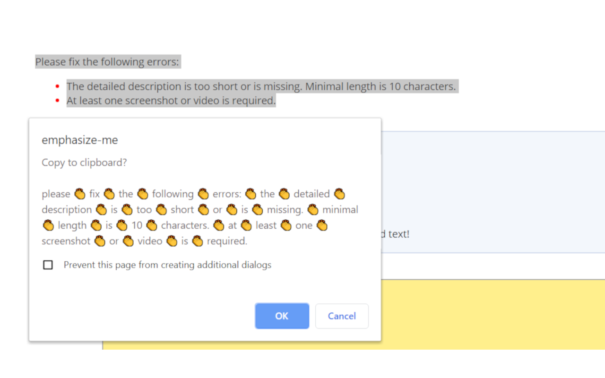

# EMPHASIZE-ME

Is someone being a bit of a dolt? Do you need to clap to drive in your comment's point? Then all you need to do is install the extension, right click on a highlighted block of text, then click `"emphasize 👏 selected 👏 text?"` to hammer in your message.

---

## Installation:

This is published on the [Chrome Web Store](https://chrome.google.com/webstore/detail/emphasize-me/pmnibpgbmhlkkphpdilcdbniceinlbfd), but if you would like to compile it from source, follow the below instructions.

- Download the source code by going to the `"Clone or Download"` button, and click `"Download ZIP"`.
- Extract the files
- Go to [chrome://extensions](chrome://extensions) and make sure `"Developer mode"` is enabled (top right corner)
- Select `"Load unpacked"` (top left corner) and upload the unzipped folder.

You're done!

---

